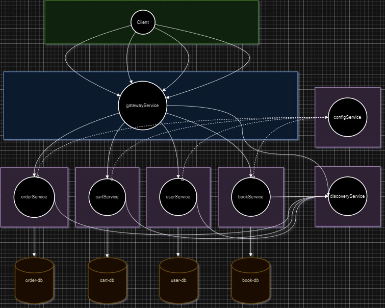

# Book store
## Intro
This is microservice application, which allows you to manage a catalog of books and handle user orders.
The application includes the following features:

 - Adding and editing books to the catalog.
 - Managing user orders.
 - User authentication and authorization.
 - API documentation.
 - Logging
## Diagram services communication

This project is built using a variety of technologies and tools to ensure a robust and efficient book store. Here's an overview of the key components:
- **Spring Boot**: This project is based on the Spring Boot framework, which simplifies the setup and development of Java applications.
- **Spring Security**: Spring Security is used to handle authentication and authorization, ensuring that only authorized users can access certain endpoints.
- **Spring Data JPA**: Spring Data JPA simplifies database access and management, allowing seamless interaction with the database using Java objects.
- **Spring Cloud Config** Client that connects to a Spring Cloud Config Server to fetch the application's configuration.
- **Spring Cloud Discovery**: It allows microservices to register themselves with a Eureka server and discover other services through the Eureka client. This dynamic approach eliminates the need for manual updates and ensures that the system can scale seamlessly.
- **Spring Cloud Routing**: Provides a simple, yet effective way to route to APIs in Servlet-based applications. Provides cross-cutting concerns to those APIs such as security, monitoring/metrics, and resiliency.
- **Swagger**: Swagger is integrated into the project to provide interactive API documentation. You can explore and test the API endpoints using the Swagger UI.
- **Docker**: Docker is used for containerization, making it easy to deploy and manage the application in various environments.
- **Database**: The project uses a relational database MySQL to store book and user data. The choice of database can be configured to fit your requirements.
- **AOP**: In this project use AOP for logging.
- **Maven**: Maven is used for project management and dependency resolution. It simplifies the build and package process.

## How to use
- **Prerequisites**:

Ensure you have Java Development Kit v17 or latest (JDK) installed on your system.
Make sure you have Docker installed if you plan to run the application in a container.
- **Clone the Repository**:

Clone the project's repository from a version control system like Git.
- **Database Configuration**:
    - ***Local database:*** Check the project's configuration files (usually in the src/main/resources directory) to configure your database connection settings. Ensure you have a MySQL and Postgres databases set up and that you provide the correct credentials.
    - ***Using Docker:*** If you haven't already installed Docker, you can download and install it from the official Docker website: https://docs.docker.com/get-docker/. In the root directory you can find docker-compose.yml file and run it. This setup will allow you to run this application along with a MySQL, Postgres databases using Docker without the need to manually install and configure:

  <pre>docker-compose up </pre> 
- **Build the Project**:

Open a terminal/command prompt in the project's root directory and run the following command for each service to build the project using Maven:
<pre>
mvn clean install
</pre>
- **Start the Application**:

If you're not using Docker, you need start all services directly by running the following commands:
bash
<pre>
java -jar target/config-service-0.0.1-SNAPSHOT.jar
java -jar target/discovery-service-0.0.1-SNAPSHOT.jar
java -jar target/gateway-service-0.0.1-SNAPSHOT.jar
java -jar target/BookService-0.0.1-SNAPSHOT.jar
java -jar target/user_service-0.0.1-SNAPSHOT.jar
java -jar target/shopping-cart-service/target/shopping-cart-service-0.0.1-SNAPSHOT.jar
java -jar target/order-service/target/order-service-0.0.1-SNAPSHOT.jar
</pre>
Don't forget about some services depends on config-service you need it run first.

If you're using Docker, you can create a Docker image for your application and then run a container. Ensure that Docker is properly configured on your system. Refer to your project's documentation for Docker-specific instructions.
Access the Application:

Once the application is up and running, you can access it by opening a web browser and navigating to the appropriate URL. The URL should be provided in the project's documentation or configuration.
API Documentation (Swagger):

Swagger is integrated into the project, you can access the interactive API documentation by navigating to the Swagger UI URL. It usually looks something like: http://localhost:8080/swagger-ui/webjars/swagger-ui/4.15.5/index.html
## API  Testing with Postman
I have provided a Postman collection that you can use to test the API endpoints easily.
This collection helps you set up contract tests to ensure that two separate systems are compatible and can communicate with one another.
Follow these steps to get started:
1. **Download Postman**: If you don't have Postman installed, you can [download it here](https://www.postman.com/downloads/).

2. **Import the Collection**:

  - Click the "Import" button in Postman.
  - Select the downloaded Postman collection file: [Postman_collection](media/MicroServices.postman_collection.json).

3. **Configure Environment**:

  - Create a new environment in Postman and set the base URL to your local or deployed API URL.
  - You can use the default values for most variables, but make sure to set the `token` variable to your authentication token if required.

4. **Run the Requests**:

  - Open the imported collection in Postman.
  - Select the desired request.
  - Click the "Send" button to execute the request.
  - Review the response to ensure everything is working as expected.
